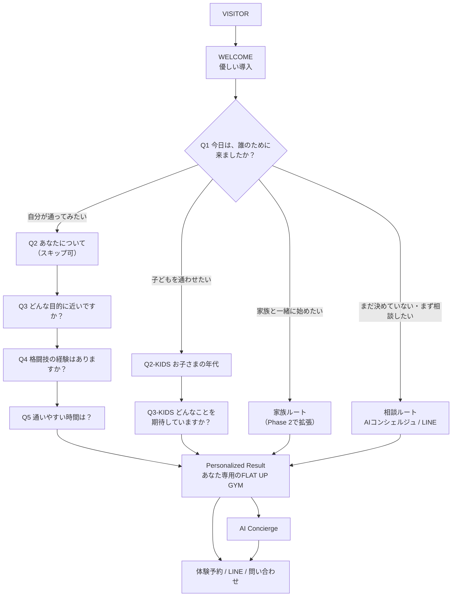

# USER_FLOWS — 質問フロー全定義

## 全体フロー



## Q1（最初の質問・最重要）

**「今日は、誰のために来ましたか？」**

| 選択肢 | 分岐先 |
|---|---|
| 自分が通ってみたい | 成人本人ルート |
| 子どもを通わせたい | キッズ保護者ルート |
| 家族と一緒に始めたい | 家族ルート |
| まだ決めていない・まず相談したい | 相談ルート |

## 成人本人ルート

### Q2 — あなたについて教えてください

- 女性 / 男性 / その他・答えたくない

**性別を必須情報として扱わない。** 答えたくなければスキップできる設計にする。

### Q3 — どんな目的に近いですか？

- 運動不足を解消したい / ダイエットしたい / ストレスを発散したい / 健康になりたい /
  格闘技をやってみたい / 強くなりたい / 護身術を身につけたい / 仲間がほしい /
  まだよく分からない

### Q4 — 格闘技の経験はありますか？

- 完全に初めて / 少しだけ経験がある / 経験者 / 現役で練習している

### Q5 — 通いやすい時間は？

- 平日の午前 / 平日の昼 / 平日の夜 / 土曜日 / まだ分からない

※実際の営業時間・クラス情報は後から正規データソース（`openqlow/src/shared/canon.ts`）へ
接続できる設計にすること。

## キッズ保護者ルート（成人ルートとは質問を変える）

### Q2-KIDS — お子さまの年代を教えてください

- 未就学 / 小学校低学年 / 小学校高学年 / 中学生 / その他

### Q3-KIDS — どんなことを期待していますか？

- 運動を好きになってほしい / 自信をつけてほしい / 礼儀を身につけてほしい /
  強くなってほしい / いじめなどへの不安がある / 体力をつけてほしい /
  試合にも挑戦してみたい / 楽しい習い事を探している / まだ分からない

## 質問の必要性レビュー（予約前に本当に必要か？）

目標は **最小質問数 × 最大パーソナライズ × 最短予約導線**。
すべての質問を「この質問は本当に予約前に必要なのか？」で判定し続ける。

| 質問 | 判定 | 理由 |
|---|---|---|
| Q1 誰のため | **必須** | 全分岐の起点。これがないとパーソナライズ不能 |
| Q2 性別 | 任意（スキップ可を維持） | 女性向け安心コンテンツに有効だが、予約には不要。必須化は禁止 |
| Q3 目的 | 必要 | 結果画面の文言・安心材料の中核 |
| Q4 経験 | 必要 | 「初めてでも大丈夫」の出し分けの中核 |
| Q5 時間帯 | **削減候補** | 予約はLINE相談で決まるため予約前必須ではない。Phase 2で効果を計測して判断 |
| Q2-KIDS 年代 | 必要 | クラス案内・保護者の安心に直結 |
| Q3-KIDS 期待 | 必要 | 保護者の不安（いじめ等）への応答に必要 |

新しい質問を追加する時も必ずこの表へ追加し、同じ基準で判定する。
「取得した方が便利」は追加理由にならない。予約後・入会後に聞けることは後回し。

## 質問はデータ駆動にする

コード全体を書き換えなくても質問を変更できる構造を目指す。

```jsonc
{
  "id": "audience",
  "question": "今日は、誰のために来ましたか？",
  "options": [
    { "value": "self",    "label": "自分が通ってみたい" },
    { "value": "kids",    "label": "子どもを通わせたい" },
    { "value": "family",  "label": "家族と一緒に始めたい" },
    { "value": "consult", "label": "まだ決めていない・まず相談したい" }
  ]
}
```

質問ロジックをハードコードしすぎない。将来の質問追加・順番変更が簡単であること。
